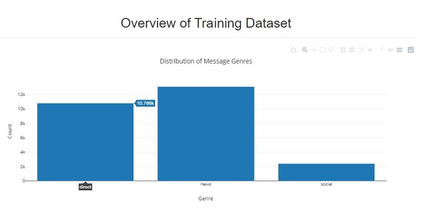
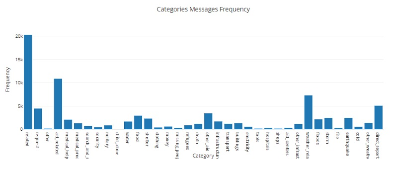
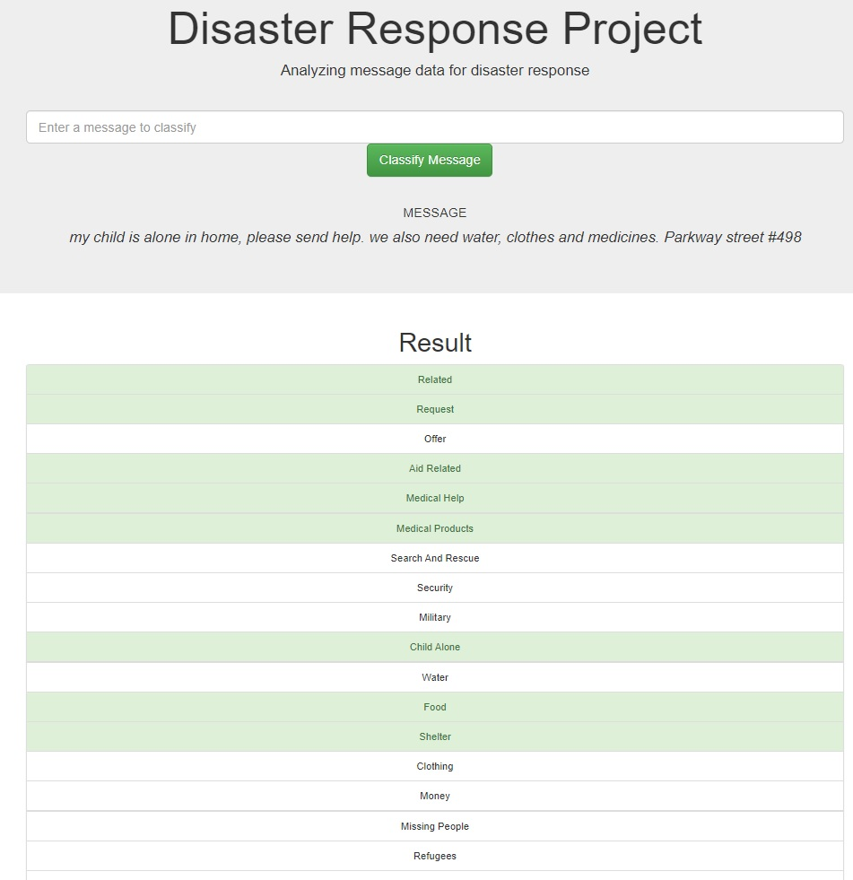

## Disaster Response Pipeline

In this project using two datasets of distress mesages from three different channels, their response categories (36) and data, NLP and Machine learning pipelines we build an web application with the optimized classifier to predict in which response category the message is likelier to belong, reducing the potential reaction time of the responding organizations.

## Installation

This project requires Python 3.x and the following Python libraries installed:

- NumPy
- Pandas
- Matplotlib
- Json
- Plotly
- Nltk
- Flask
- Sklearn
- Sqlalchemy
- Sys
- Re
- Pickle

## Files Description

        disaster-response
          |-- app
                |-- templates
                        |-- go.html
                        |-- master.html
                |-- run.py
          |-- data
                |-- disaster_message.csv
                |-- disaster_categories.csv
                |-- messagesDB.db
                |-- process_data.py
          |-- images
                |-- header.jfif
          |-- models
                |-- classifier.pkl
                |-- train_classifier.py
          |-- notebooks
                |-- ETL Pipeline Preparation.ipynb
                |-- ML Pipeline Preparation.ipynb
          |-- README
          |-- LICENSE

## Web Application Screenshots

Visual 1

Visual 2

Visual 3

## Instructions

1. Run the following commands in the project's root directory to set up your database and model.

    - To run ETL pipeline that cleans data and stores in database
        `python data/process_data.py data/disaster_messages.csv data/disaster_categories.csv data/DisasterResponse.db`
    - To run ML pipeline that trains classifier and saves
        `python models/train_classifier.py data/DisasterResponse.db models/classifier.pkl`

2. Run the following command in the app's directory to run your web app.
    `python run.py`

3. Go to http://0.0.0.0:3001/

## License

Apache
